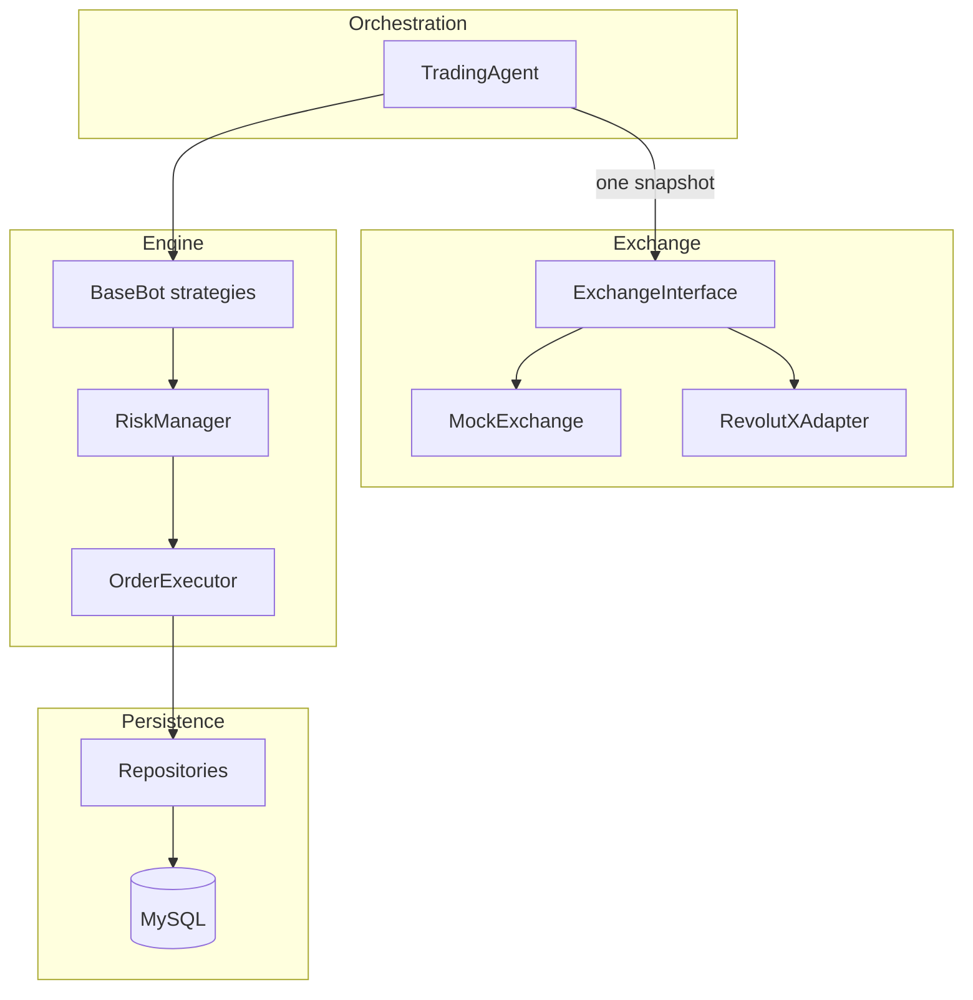

# Cryptotrader

**Async multi-bot cryptocurrency trading engine** — independent strategies share **one market snapshot per cycle**, execute against **paper state in MySQL**, and swap exchanges via a **small protocol** (`MockExchange` today, Revolut X tomorrow).

```text
TradingAgent → ExchangeInterface.get_market_snapshot (once)
            → persist snapshot (JSON + normalized quotes)
            → each Bot.decide(snapshot)
            → RiskManager → OrderExecutor → DB
```

## Features

- **Multi-bot**: aggressive, passive, smart (plug-in registry — add a class, register the name).
- **Single snapshot per cycle**: no per-bot exchange calls; bots only see shared `MarketSnapshot`.
- **Decimal-safe**: money and sizes use `Decimal`; config uses string decimals.
- **MySQL + SQLAlchemy 2 async** + **repository pattern** (no raw SQL outside `Database/`).
- **Risk controls**: min notional, per-symbol notional cap vs equity, max drawdown, daily loss limit, circuit breaker after rejection streaks.
- **Resilience**: tenacity-backed retries around each cycle; failures are logged and the loop continues.
- **Config**: YAML + `.env` overrides (`Utils/config_loader.py`).

## Quick start

**Prerequisites:** Python 3.12+, [uv](https://docs.astral.sh/uv/), local MySQL with a database and user (see `config.yaml.example`).

```bash
uv sync --all-extras
cp config.yaml.example config.yaml
# Edit config.yaml — set database.* and optional bots
cp .env.example .env
uv run python main.py
```

Environment overrides (optional): `CRYPTOTRADER_DB_*`, `CRYPTOTRADER_EXCHANGE`, `CRYPTOTRADER_CONFIG_PATH` — see `Utils/config_loader.py`.

## How to add a new bot strategy

1. Create `Engine/bots/my_bot.py` subclassing `BaseBot` with `async def decide(self, context: BotContext, snapshot: MarketSnapshot) -> Decision`.
2. Register it: `StrategyRegistry.register("my_strategy", MyBot)` (or edit `Engine/bot_manager.py` `_map`).
3. Add a row under `bots:` in `config.yaml` with `strategy: my_strategy` and `allocated_capital` (seeded on first run).

Example skeleton:

```python
from decimal import Decimal
from Engine.bots.base_bot import BaseBot
from Engine.models import Action, BotContext, Decision, MarketSnapshot

class MyBot(BaseBot):
    async def decide(self, context: BotContext, snapshot: MarketSnapshot) -> Decision:
        sym = str(context.config.get("symbol", "BTC")).upper()
        return Decision(action=Action.HOLD, currency=sym, amount=Decimal("0"))
```

## Architecture



## Roadmap

1. **Revolut X live** — HTTP quotes / orders behind `RevolutXAdapter` (`revolut.use_stub: false`, API key in `.env`).
2. **Backtester** — replay `market_data` + `market_quotes` snapshots.
3. **Web UI** — dashboards for `bot_metrics`, positions, and logs.
4. **Execution realism** — slippage, partial fills, exchange-specific fees.

## Tech stack

| Layer        | Choice                                      |
| ------------ | ------------------------------------------- |
| Runtime      | Python 3.12+, asyncio                       |
| DB           | MySQL, SQLAlchemy 2.0 async, aiomysql       |
| Config       | PyYAML, python-dotenv                       |
| Resilience   | tenacity                                    |
| Tooling      | uv, ruff, mypy, pytest, pytest-asyncio      |

## Contributing

See [CONTRIBUTING.md](CONTRIBUTING.md).

## License

MIT — see [LICENSE](LICENSE).
